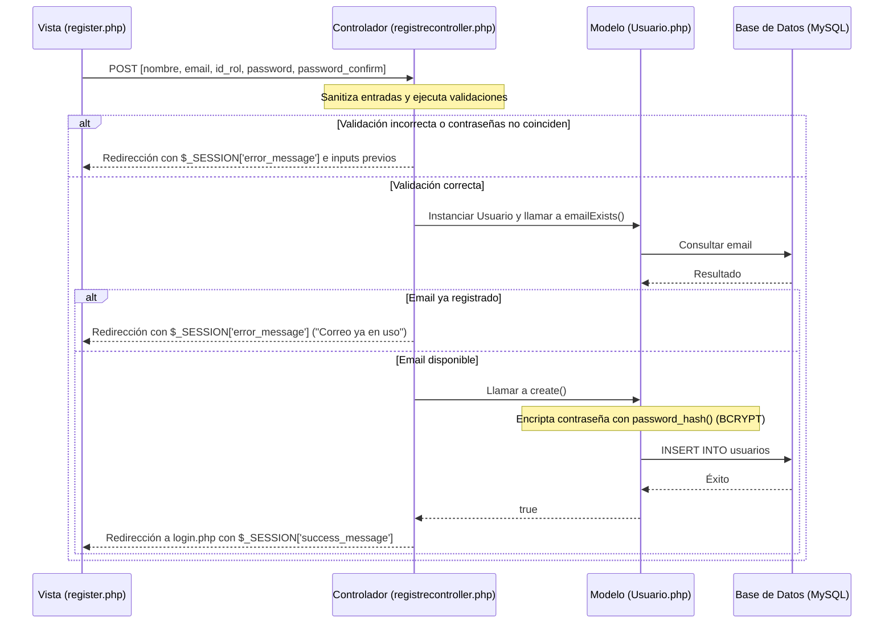

# Documentación de la Lógica de Registro - AgroStock

Este documento describe la arquitectura, el flujo de datos y la alineación entre la interfaz de usuario y la base de datos para el módulo de registro de empleados del sistema AgroStock.

## 1. Mapeo de Campos de Registro a la Base de Datos

El formulario de registro (`view/auth/register.php`) ha sido ajustado para enviar los siguientes campos en la petición HTTP POST, los cuales coinciden directamente con las columnas de la tabla `usuarios` en MySQL:

| Campo Formulario (HTML `name`) | Columna DB (`usuarios`) | Tipo de Datos (DB) | Descripción |
|---|---|---|---|
| `nombre` | `nombre` | `varchar(100)` | Nombre completo del empleado. |
| `email` | `email` | `varchar(100)` (Unique) | Correo institucional del empleado. |
| `id_rol` | `id_rol` | `int` (Foreign Key) | Identificador numérico del rol del empleado. |
| `password` | `password` | `varchar(255)` | Contraseña del empleado (almacenada como hash encriptado). |
| *Ninguno (cliente)* | `estado` | `boolean` (Default: 1) | Estado de la cuenta (activo/inactivo). |
| *Ninguno (servidor)* | `fecha_creacion` | `datetime` | Fecha y hora en la que se crea el registro. |

---

## 2. Alineación de Roles

La tabla `roles` en la base de datos ha sido actualizada para coincidir exactamente con los perfiles del personal de AgroStock:

1. **ID 1: admin** (Administrador del Almacén)
2. **ID 2: Bodeguero** (Encargado de Bodega / Stock)
3. **ID 3: Vendedor** (Cajero / Vendedor de Punto de Venta)

El select de cargos en el formulario de registro ahora envía estos IDs numéricos correspondientes al backend:
```html
<select name="id_rol" required>
    <option value="1">Administrador del Almacén</option>
    <option value="2">Encargado de Bodega / Stock</option>
    <option value="3">Cajero / Vendedor de Punto de Venta</option>
</select>
```

---

## 3. Flujo de Datos de Registro

El registro de usuarios sigue el patrón MVC (Modelo-Vista-Controlador):



---

## 4. Medidas de Seguridad Aplicadas

1. **Encriptación de Contraseñas**: Las contraseñas nunca se guardan en texto plano en la base de datos. Se encriptan utilizando el algoritmo nativo de PHP `password_hash($password, PASSWORD_BCRYPT)`.
2. **Sanitización de Entradas**: Se remueven etiquetas HTML y espacios en blanco al principio/final usando `trim()`, `htmlspecialchars()` y `strip_tags()` para prevenir inyección de código.
3. **Prevención de Duplicados**: Se valida en base de datos la unicidad del correo electrónico antes de proceder con el insert.
